# PRVHASH - Pseudo-Random-Value Hash #

## Introduction ##

PRVHASH is a hash function that generates a [uniform pseudo-random number
sequence](https://en.wikipedia.org/wiki/Pseudorandom_number_generator)
derived from the message. PRVHASH is conceptually similar (in the sense of
using a pseudo-random number sequence as a hash) to [`keccak`](https://en.wikipedia.org/wiki/SHA-3)
and [`RadioGatun`](https://en.wikipedia.org/wiki/RadioGat%C3%BAn)
schemes, but is a completely different implementation of such concept.
PRVHASH is both a ["randomness extractor"](https://en.wikipedia.org/wiki/Randomness_extractor)
and an "extendable-output function" (XOF).

PRVHASH can generate 64- to unlimited-bit hashes, yielding hashes of
approximately equal quality independent of the chosen hash length. PRVHASH is
based on 64-bit math. The use of the function beyond 1024-bit hashes is easily
possible, but has to be statistically tested. For example, any 32-bit element
extracted from 2048-, or 4096-bit resulting hash is as collision resistant as
just a 32-bit hash. It is a fixed execution time hash function that depends
only on message's length. A streamed, higher-security, hashing implementation
is available.

PRVHASH is solely based on the butterfly effect, inspired by [LCG](https://en.wikipedia.org/wiki/Linear_congruential_generator)
pseudo-random number generators. The generated hashes have good avalanche
properties. For best security, a random seed should be supplied to the hash
function, but this is not a requirement.

64-, 128-, 192-, 256-, 512-, and 1024-bit PRVHASH hashes pass all
[SMHasher](https://github.com/rurban/smhasher) tests. Other hash lengths were
not thoroughly tested, but extrapolations can be made. The author makes no
cryptographic claims (neither positive nor negative) about PRVHASH-based
constructs.

PRVHASH core function can be used as a PRNG with an arbitrarily-chosen
(practically unlimited) period, depending on the number of hashwords in the
system.

Please see the `prvhash64.h` file for the details of the basic hash function
implementation (the `prvhash.h`, `prvhash4.h`, `prvhash42.h` are outdated
versions). While this hash function is most likely irreversible, according to
SAT solver-based testing, it does not feature a preimage resistance. This
function should not be used in open systems, without a secret seed. Note that
`64` refers to core function's variable size.

The default `prvhash64.h`-based 64-bit hash of the string `The cat is out of
the bag` is `eb405f05cfc4ae1c`.

A proposed short name for hashes created with `prvhash64.h` is `PRH64-N`,
where `N` is the hash length in bits (e.g. `PRH64-256`).

## Minimal PRNG for Everyday Use ##

The core function can be easily integrated into your applications, to be used
as an effective PRNG. The period of this minimal PRNG is at least
2<sup>159</sup>. The initial parameters can be varied at will, and won't
"break" the PRNG. Setting only the `Seed` value guarantees a random start
point within the whole PRNG period, with at least 2<sup>64</sup> spacing.
The code follows.

```
#include "prvhash_core.h"
#include <stdio.h>

int main()
{
	uint64_t Seed = 0;
	uint64_t lcg = 0;
	uint64_t Hash = 0;

	uint64_t v = 0;
	uint64_t i;

	for( i = 0; i < ( 1ULL << 28 ); i++ )
	{
		v = prvhash_core64( &Seed, &lcg, &Hash );
	}

	printf( "%llu\n", v );
}
```

For implementation assurance, here are the first 16 output values in hex
(starting from the all-zeroes state):

```
	0x5555555555555555 0x00000000DB6DB6DB 0x2492492192492492 0x75D75DA0AAAAAA79
	0x93064E905C127FE5 0xE2585C9CA95671A3 0x28A44B31D428179E 0x11B0B6A8D4BA3A73
	0x195C6A4C23EE71AD 0x5AA47859226BA23E 0xA7D42121695056D4 0x142D7CD5D83342F2
	0x3D42E83328C09C8F 0x7E691C66BAC23222 0x82E1032F441F23A5 0xA4BDE5C4A05E6256
```

Note that such minimal 1-hashword PRNG is most definitely not
cryptographically-secure: its state can be solved by a SAT solver pretty fast;
this applies to other arrangements ("fused", "parallel", multiple hashwords;
with daisy-chaining being harder to solve). The known way to make PRNG
considerably harder to solve for a SAT solver, with complexity corresponding
to system's size, is to combine two adjacent PRNG outputs via XOR operation;
this obviously has a speed impact and produces output with more than 1
solution (most probably, 2). This, however, does not measurably increase the
probability of PRNG output overlap, which stays below
1/2<sup>sys_size_bits</sup>; in tests, practically undetectable.

So, the basic PRNG with some, currently not formally-proven, security is as
follows (XOR two adjacent outputs to produce a single "compressed" PRNG
output):

```
		v = prvhash_core64( &Seed, &lcg, &Hash );
		v ^= prvhash_core64( &Seed, &lcg, &Hash );
```

A similar approach is to simply skip the next generated random number, but it
is slightly less secure. It is likely that PRVHASH's k-equidistribution of
separate outputs is implicitly secure. The reason is that skipping or XORing
creates uncertainty or entanglement of current output with system's state
hash-array number of outputs back. 3 XORs are needed to provide pre-image
resistance, or resistance against selection of entropy input that leads to
a particular output.

## TPDF Dithering ##

The core function can be used to implement a "statistically-good" and
"neutrally-sounding" dithering noise for audio signals; for both
floating-point to fixed-point, and bit-depth conversions.

	uint64_t rv = prvhash_core64( &Seed, &lcg, &Hash );
	double tpdf = ( (int64_t) (uint32_t) rv - (int64_t) ( rv >> 32 )) * 0x1p-32;

## Floating-Point PRNG ##

The following expression can be used to convert 64-bit unsigned value to
full-mantissa floating-point value, without a truncation bias:

	uint64_t rv = prvhash_core64( &Seed, &lcg, &Hash );
	double v = ( rv >> ( 64 - 53 )) * 0x1p-53;

## Gradilac PRNG (C++) ##

The `gradilac.h` file includes the Gradilac C++ class which is a generalized
templated implementation of PRVHASH PRNG that provides integer, single bit,
floating-point, TPDF, Normal random number generation with a straight-forward
front-end to specify PRVHASH system's properties. Supports on-the-go
re-seeding, including re-seeding using sparse entropy (for CSPRNG uses). Does
not require other PRVHASH header files.

Use `Gradilac< 316 >` to match Mersenne Twister's PRNG period.

Note that this class may not be as efficient for "bulk" random number
generation as a custom-written code. Nevertheless, Gradilac PRNG class, with
its 1.0 cycles/byte floating-point performance (at default template settings),
is competitive among other C++ PRNGs.

## PRVHASH64_64M ##

This is a minimized implementation of the `prvhash64` hash function. Arguably,
it is the smallest hash function in the world, that produces 64-bit hashes of
this quality level. While this function does not provide a throughput that can
be considered "fast", due to its statistical properties it is practically fast
for hash-maps and hash-tables.

## Entropy PRNG ##

PRVHASH can be also used as an efficient general-purpose PRNG with an external
entropy source injections (like how the `/dev/urandom` works on Unix): this
was tested, and works well when 8-bit true entropy injections are done
inbetween 8 to 2048 generated random bytes (delay is also obtained via the
entropy source). An example generator is implemented in the `prvrng.h` file:
simply call the `prvrng_test64p2()` function.

`prvrng_gen64p2()`-based generator passes [`PractRand`](http://pracrand.sourceforge.net/)
32 TB threshold with rare non-systematic "unusual" evaluations. Which suggests
it is the working randomness extractor that can "recycle" entropy of any
statistical quality, probably the first in the world.

Note that due to the structure of the core function the probability of PRNG
completely "stopping", or "stalling", or losing internal entropy, is absent.

The core function, without external entropy injections, with any initial
combination of `lcg`, `Seed`, and `Hash` eventually converges into one of
random number sub-sequences. These are mostly time-delayed versions of only a
smaller set of unique sequences. There are structural limits in this PRNG
system which can be reached if there is only a small number of hashwords in
the system. PRNG will continously produce non-repeating random sequences given
external entropy input, but their statistical quality on a larger frames will
be limited by the size of `lcg` and `Seed` variables, and the number of
hashwords in the system, and the combinatorial capacity of the external
entropy. A way to increase the structural limit is to use the "fused" PRNG
arrangement demonstrated in the `prvhash64s.h` file, which additionally
increases the security exponentially. Also any non-constant entropy input
usually increases the period of randomness, which, when extrapolated to
hashing, means that the period increases by message's combinatorial capacity
(or the number of various combinations of its bits). The maximal PRNG period's
2<sup>N</sup> exponent is hard to approximate exactly, but in most tests it
was equal to at least system's size in bits, minus the number of hashwords in
the system, minus 1/4 of `lcg` and `Seed` variables' size (e.g., `159` for a
minimal PRNG).

Moreover, the PRVHASH systems can be freely daisy-chained by feeding their
outputs to `Seed`/`lcg` inputs, adding some security firewalls, and increasing
the PRNG period of the final output accordingly. Note that any external PRNG
output can be inputted via either `Seed`, `lcg`, or both, yielding PRNG period
exponent summation. For hashing and external unstructured entropy, only
simultaneous input via `Seed` and `lcg` works in practice (period's exponent
increase occurs as well).

While `lcg`, `Seed`, and `Hash` variables are best initialized with good
entropy source (however, structurally, they can accept just about any entropy
quality while only requiring an initial "conditioning"), the message can be
sparsely-random: even an increasing counter can be considered as having a
suitable sparse entropy.

## Two-Bit PRNG ##

This is a "just for fun" example, but it passes 256 MB PractRand threshold.
You CAN generate pseudo-random numbers by using 2-bit shuffles; moreover, you
can input external entropy into the system.

```
#include <stdio.h>
#include "prvhash_core.h"
#define PH_HASH_COUNT 42

int main()
{
	uint8_t Seed = 0;
	uint8_t lcg = 0;
	uint8_t Hash[ PH_HASH_COUNT ] = { 0 };
	int HashPos = 0;
	int l;

	for( l = 0; l < 256; l++ )
	{
		uint8_t r = 0;
		int k;

		for( k = 0; k < 4; k++ )
		{
			r <<= 2;
			r |= prvhash_core2( &Seed, &lcg, Hash + HashPos );

			HashPos++;

			if( HashPos == PH_HASH_COUNT )
			{
				HashPos = 0;
			}
		}

		if( l > PH_HASH_COUNT / 3 ) // Skip PRNG initialization.
		{
			printf( "%4i ", (int) r );
		}
	}
}
```

## Streamed Hashing ##

The file `prvhash64s.h` includes a relatively fast streamed hashing function
which utilizes a "fused" PRVHASH arrangement. Please take a look at the
`prvhash64s_oneshot()` function for usage example. The `prvhash64s` offers
an increased security and hashing speed.

This function has an increased preimage resistance compared to the basic
hash function implementation. Preimage resistance cannot be currently
estimated exactly, but the hash length affects it exponentially. Also,
preimage attack usually boils down to exchange of forged symbols to "trash"
symbols (at any place of the data stream); substitutions usually end up as
being quite random, possibly damaging to any compressed or otherwise
structured file. Which means that data compression software and libraries
should always check any left-over, "unused", data beyond the valid compressed
stream, for security reasons.

Time complexity for preimage attack fluctuates greatly as preimage resistance
likely has a random-logarithmic PDF of timing.

Even though a formal proof is not yet available, the author assumes this
hash function can compete with widely-used SHA2 and SHA3 families of hash
functions while at the same time offering a considerably higher performance
and scalability. When working in open systems, supplying a secret seed is not
a requirement for this hash function.

The performance (expressed in cycles/byte) of this hash function on various
platforms can be evaluated at the
[ECRYPT/eBASH project](https://bench.cr.yp.to/results-hash.html).

The default `prvhash64s.h`-based 64-bit hash of the string `The cat is out of
the bag` is `2043ccf52ae2ca6f`.

The default `prvhash64s.h`-based 256-bit hash of the string
`Only a toilet bowl does not leak` is
`b13683799b840002689a1a42d93c826c25cc2d1f1bc1e48dcd005aa566a47ad8`.

The default `prvhash64s.h`-based 256-bit hash of the string
`Only a toilet bowl does not leaj` is
`d4534a922fd4f15ae8c6cc637006d1f33f655b06d60007a226d350e87e866250`.

This demonstrates the [Avalanche effect](https://en.wikipedia.org/wiki/Avalanche_effect).
On a set of 216553 English words, pair-wise hash comparisons give average
50.0% difference in resulting hash bits, which fully satisfies the strict
avalanche criterion.

This streamed hash function produces hash values that are different to the
`prvhash64` hash function. It is incorrect to use both of these hash function
implementations on the same data set. While `prvhash64` can be used as a hash
for hash-tables and in-memory data blocks, `prvhash64s` can be used to create
hashes of large data blocks like files, in streamed mode.

A proposed short name for hashes created with `prvhash64s.h` is `PRH64S-N`,
where `N` is the hash length in bits (e.g. `PRH64S-256`). Or simply, `SH4-N`,
`Secure Hash 4`.

## Description ##

Here is the author's vision on how the core function works. In actuality,
coming up with this solution was accompanied by a lot of trial and error.
It was especially hard to find a better "hashing finalization" solution.

	Seed ^= msgw; lcg ^= msgw; // Mix in external entropy (or daisy-chain).

	Seed *= lcg * 2 + 1; // Multiply random by random, without multiply by zero.
	const uint64_t rs = Seed >> 32 | Seed << 32; // Produce halves-swapped copy.
	Hash += rs + 0xAAAAAAAAAAAAAAAA; // Accumulate to hash, add raw entropy (self-start).
	lcg += Seed + 0x5555555555555555; // Output-bound entropy accumulation, add raw entropy.
	Seed ^= Hash; // Mix new seed value with hash. Entropy feedback.
	const uint64_t out = lcg ^ rs; // Produce "compressed" output.

This function can be arbitrarily scaled to any even-sized variables: 2-, 4-,
8-, 16-, 32-, 64-bit variable sizes were tested, with similar statistical
results. Since mathematical structure of the function does not depend on the
variables' size, statistical analysis can be performed using smaller variable
sizes, with the results being extrapolatable to larger variable sizes, with a
high probability (the function is invariant to the variable size). Also note
that the `0xAAAA...` constant is not an arbitrary constant since it should be
produced algorithmically by replicating the `10` bit-pairs, to match the
variable size; it represents the "raw entropy bit-train". The same applies to
the `0x5555...` constant. An essential property of these bit-trains is that
they are uncorrelated to any uniformly-random bit-sequences, at all times.
Practically, `10` and `01` bit-pairs can be also used as constants, without
replication, but this does not provide conclusively better results for PRNG,
and does not work well for hashing; also, self-starting period becomes
longer. A conceptual aspect of replicated bit-pairs is that they represent the
simplest maximum-entropy number that lacks information (bit-pair is a minimal
sequence that can exhibit entropy, with replication count bound to state
variable size). While "magic numbers" can be used instead of these bit-trains
(at least for PRNG), they do not posses the property of not having an
information (zero spectrum beside DC and Nyquist components).

It is important to point out that the presence of the `0xAAAA...` and
`0x5555...` constants logically assure that the `Seed` and `lcg` variables
quickly recover from the "zero-state". Beside that, these constants logically
prohibit synchronous control over `Seed` and `lcg` variables: different bits
of the input entropy will reach these variables. When the system starts from
the "zero-state", with many hashwords in the system, it is practically
impossible to find a preimage (including a repetitious one) that stalls the
system, and thus it is impossible to perform a multi-collision attack.
However, since this risk cannot be estimated exactly, the `prvhash64s` hash
function adds a message length value to the end of the data stream.

How does it work? First of all, this PRNG system, represented by the core
function, does not work with numbers in a common sense: it works with
[entropy](https://en.wikipedia.org/wiki/Entropy_(information_theory)),
or random sequences of bits. The current "expression" of system's overall
internal entropy - the `Seed` - gets multiplied ("smeared") by a supporting,
output-bound variable - `lcg`, - which is also a random value, transformed in
an LCG-alike manner. As a result, a new random value is produced which
represents two independent random variables (in lower and higher parts of the
register), a sort of "entropy stream sub-division" happens. This result is
then halves-swapped, and is accumulated in the `Hash` together with the `10`
bit-train which adds the "raw entropy", allowing the system to be
self-starting. The original multiplication result is accumulated in the `lcg`
variable. The `Seed` is then updated with the hashword produced on previous
rounds. The reason the message's entropy (which may be sparse or non-random)
does not destabilize the system is because the message becomes hidden in the
internal entropy (alike to a cryptographic one-time-pad); message's
distribution becomes unimportant, and system's state remains statistically
continuous. Both accumulations - of the halves-swapped and the original
result of multiplication - produce a uniformly-distributed value in the
corresponding variables; a sort of "de-sub-division" happens in these.

The two instructions - `Seed *= lcg * 2 + 1`, `lcg += Seed` - represent an
"ideal" bit-shuffler: this construct represents a "bivariable shuffler" which
transforms the input `lcg` and `Seed` variables into another pair of variables
with 50% bit difference relative to input, and without collisions. The whole
core function, however, uses a more complex mixing which produces a hash
value: the pair composed of the hash value and either a new `lcg` or a new
`Seed` value also produces no input-to-output collisions. Thus it can be said
that the system does not lose any input entropy. In 4-dimensional analysis,
when `Seed`, `lcg`, `Hash`, and `msgw` values are scanned and transformed into
subsequent `Seed`, `lcg`, and `Hash` triplets, this system does not exhibit
local state change-related collisions due to external entropy input (all
possible input `msgw` values map to subsequent triplets uniquely). However,
with a small variable size (8-bit) and a large output hash size, a sparse
entropy input has some probability of "re-sychronization" event happening,
leading to local collisions. With 16-bit variables, or even 8-bit fused-2
arrangement (with the local state having 40-bit size instead of 24-bit),
probability of such event is negligible. While non-fused hashing may even
start from the "zero-state", for reliable hashing the state after 5
"conditioning" rounds should be used.

Another important aspect of this system, especially from the cryptography
standpoint, is the entropy input to output latency. The base latency for
state-to-state transition is equal to 1 (2 for "fused" arrangements); and at
the same time, 1 in hash-to-hash direction: this means that PRVHASH
additionally requires a full pass through the hashword array, for the entropy
to propagate, before using its output. However, hashing also requires a pass
to the end of the hashword array if message's length is shorter than the
output hash, to "mix in" the initial hash value. When there is only 1 hashword
in use, there is no hashword array-related delay, and thus the entropy
propagation is only subject to the base latency. The essence of these
"latencies" is that additional rounds are needed for the system to get rid of
a statistical traces of the input entropy. Note that the "fused" arrangement
increases shuffling quality. However, this increase is relative to state
variable size: for example, 8-bit fused-2 arrangement with 8-bit input is
equivalent to 16-bit non-fused arrangement with 16-bit input. So, it is
possible to perform hashing with 8-bit state variables if fused-2 round is
done per 1 input byte. The way "fused" structure works is equivalent to
shuffling all entropy inputs in a round together (input 1 is shuffled into a
hash value which is then shuffled with input 2 into a hash value, etc). The
"fused" arrangement may raise a question whether or not it provides a target
collision resistance as it seemingly "compresses" several inputs into a single
local hashword: without doubt it does provide target collision resistance
since `Seed` and `lcg` variables are a part of the system, and their presence
in the "fused" arrangement increases the overall PRNG period of the system and
thus its combinatorial capacity.

Without external entropy (message) injections, the function can run for a
prolonged time, generating pseudo-entropy, in extendable-output PRNG mode.
When the external entropy (message) is introduced, the function "shifts" into
an unrelated state unpredictably. So, it can be said that the function "jumps"
within a space of a huge number of pseudo-random sub-sequences. Hash
length affects the size of this "space of sub-sequences", permitting the
function to produce quality hashes for any required hash length.
Statistically, these "jumps" are close to uniformly-random repositioning: each
simultaneous augmentation of `Seed` and `lcg` corresponds to a new random
position, with a spread over the whole PRNG period. The actual performace is
more complicated as this PRNG system is able to converge into unrelated random
number sequences of varying lengths, so the "jump" changes both the position
and the "index" of sub-sequence. This property of PRVHASH assures that
different initial states of its `Seed` state variable (or `lcg`, which is
mostly equivalent at initialization stage) produce practically unrelated
random number sequences, permitting to use PRVHASH for PRNG-based simulations.

In essence, the hash function generates a continuous pseudo-random number
sequence, and returns the final part of the sequence as a result. The message
acts as a "pathway" to this final part. So, the random sequence of numbers can
be "programmed" to produce a necessary outcome. However, as this PRNG does
not expose its momentary internal state, such "programming" is hardly possible
to perform for an attacker, even if the entropy input channel is exposed:
consider the `(A^C)*(B^C)` equation; an adversary can control `C`, but does
not know the values of `A` and `B`; thus this adversary cannot predict the
outcome. Beside that, as the core function naturally eliminates the bias from
the external entropy of any statistical quality and frequency, its control may
be fruitless. Note that to reduce such "control risks", the entropy input
should use as fewer bits as possible, like demonstrated in the `prvrng.h`
file.

P.S. The reason the InitVec in the `prvhash64` hash function has the value
quality constraints, and an initial non-zero state, is that otherwise the
function would require 5 preliminary "conditioning" rounds (core function
calls) to neutralize any oddities (including zero values) in InitVec; that
would reduce the performance of the hash function dramatically, for hash-table
uses. Note that the `prvhash64s` function starts from the "full zero" state
and then performs acceptably.

## Hashing Method's Philosophy ##

Any external entropy (message) that enters this PRNG system acts as a
high-frequency and high-quality re-seeding which changes the random number
generator's "position" within the PRNG period, randomly. In practice, this
means that two messages that are different in even 1 bit, at any place,
produce "final" random number sequences, and thus hashes, which are completely
unrelated to each other. This also means that any smaller part of the
resulting hash can be used as a complete hash. Since the hash length affects
the PRNG period (and thus the combinatorial capacity) of the system, the same
logic applies to hashes of any length while meeting collision resistance
specifications for all lengths.

Alternatively, the hashing method can be viewed from the standpoint of classic
bit-mixers/shufflers: the hashword array can be seen as a "working buffer"
whose state is passed back into the "bivariable shuffler" continuously, and
the new shuffled values stored in this working buffer for the next pass.

In general, PRVHASH core function represents a "building block" that permits
design of practically any entropy-generating constructs. It has an important
advantage in that the state space of these constructs can be completely
analyzed using small state variables, with the obtained statistics being
extrapolatable to larger state variables.

## PRNG Period Assessment ##

The following "minimal" implementation of PractRand class can be used to
independently assess randomness period properties of PRVHASH. By varying
the `PH_HASH_COUNT` and `PH_PAR_COUNT` values it is possible to test various
PRNG system sizes. By adjusting other values it is possible to test PRVHASH
scalability across different state variable sizes (PractRand class and PRNG
output size should be matched, as PractRand test results depend on PRNG output
size). PractRand should be run with the `-tlmin 64KB` parameter, to evaluate
changes to the constants quicker. Note that both `PH_HASH_COUNT` and
`PH_PAR_COUNT` affect the PRNG period exponent not exactly linearly for small
variable sizes: there is a saturation factor present for small variable sizes;
after some point the period increase is non-linear due to small shuffling
space. Shuffling space can be increased considerably with a "fused"
arrangement. Depending on the initial seed value, the period may fluctuate.
The commented out `Ctr++...` instructions can be uncommented to check the
period increase due to sparse entropy input. You may also notice the `^=h`
instructions: PRVHASH supports feedback onto itself (it is like hashing its
own output). This operation, which can be applied to any fused element,
maximizes the achieved PRNG period.

```
#include "prvhash_core.h"
#include <string.h>

#define PH_FUSE_COUNT 1 // PRVHASH fusing.
#define PH_HASH_COUNT 4 // Hashword count (any positive number).
#define PH_STATE_TYPE uint8_t // State variable's physical type.
#define PH_FN prvhash_core4 // Core function name.
#define PH_BITS 4 // State variable's size in bits.
#define PH_RAW_BITS 8 // Raw output bits.
#define PH_RAW_ROUNDS ( PH_RAW_BITS / PH_BITS ) // Rounds per raw output.

class DummyRNG : public PractRand::RNGs::vRNG8 {
public:
    PH_STATE_TYPE Seed[ PH_FUSE_COUNT ];
    PH_STATE_TYPE lcg[ PH_FUSE_COUNT ];
    PH_STATE_TYPE Hash[ PH_HASH_COUNT ];
    int HashPos;

    DummyRNG() {
        memset( Seed, 0, sizeof( Seed ));
        memset( lcg, 0, sizeof( lcg ));
        memset( Hash, 0, sizeof( Hash ));
        HashPos = 0;

        // Initialize.

        int k, j;

        for( k = 0; k < PRVHASH_INIT_COUNT; k++ )
        {
            for( j = 0; j < PH_FUSE_COUNT; j++ )
            {
                PH_FN( Seed + j, lcg + j, Hash + HashPos );
            }
        }
    }

    Uint8 raw8() {
        uint64_t OutValue = 0;
        int k, j;

        for( k = 0; k < PH_RAW_ROUNDS; k++ )
        {
//            Ctr++;
//            Seed[ 0 ] ^= ( Ctr ^ ( Ctr >> 4 )) & 15;
//            lcg[ 0 ] ^= ( Ctr ^ ( Ctr >> 4 )) & 15;

            uint64_t h = 0;

            for( j = 0; j < PH_FUSE_COUNT; j++ )
            {
                h = PH_FN( Seed + j, lcg + j, Hash + HashPos );
            }

//            Seed[ 0 ] ^= h;
//            lcg[ 0 ] ^= h;

            if( PH_BITS < sizeof( uint64_t )) OutValue <<= PH_BITS;
            OutValue |= h;

            if( ++HashPos == PH_HASH_COUNT )
            {
                HashPos = 0;
            }
        }

        return( OutValue );
    }

    void walk_state(PractRand::StateWalkingObject *walker) {}
    void seed(Uint64 sv) { Seed[ 0 ] ^= sv; }
    std::string get_name() const { return "PRVHASH"; }
};
```

## PRVHASH Cryptanalysis Basics ##

When the system state is not known, when PRVHASH acts as a black-box, one has
to consider core function's statistical properties. All internal variables -
`Seed`, `lcg`, and `Hash` - are random: they are uncorrelated to each other at
all times, and are also wholly-unequal during the PRNG period (they are not
just time-delayed versions of each other). Moreover, as can be assured with
PractRand, all of these variables can be used as random number generators
(with a lower period, though); they can even be interleaved after each core
function call.

When the message enters the system via `Seed ^= msgw` and `lcg ^= msgw`
instructions, this works like mixing a message with an one-time-pad used in
cryptography. This operation completely hides the message in system's entropy,
while both `Seed` and `lcg` act as "carriers" that "smear" the input message
via subsequent multiplication. Beside that, the output of PRVHASH uses the mix
of two variables: statistically, this means mixing of two unrelated random
variables, with such summary output never appearing in system's state. It is
worth noting the `lcg ^ rs` expression: the `rs` variable is composed of two
halves, both of them practically being independent PRNG outputs, with smaller
periods. This additionally complicates system's reversal.

## Parallel PRNG ##

While this "parallel-3" arrangement is currently not used in the hash function
implementations, it is also working fine with the core function. For example,
while the "minimal PRNG" described earlier has `0.90` cycles/byte performance,
the "parallel" arrangement has a PRNG performance of `0.35` cycles/byte, with
a possibility of further scaling using AVX-512 instructions. Note that the
number of "parallel" elements should not be a multiple of hashword array size,
otherwise PRNG stalls.

```
#include "prvhash_core.h"
#include <stdio.h>

int main()
{
	uint64_t Seed = 0;
	uint64_t lcg = 0;
	uint64_t Hash = 0;
	uint64_t Seed2 = 0;
	uint64_t lcg2 = 0;
	uint64_t Hash2 = 0;
	uint64_t Seed3 = 0;
	uint64_t lcg3 = 0;
	uint64_t Hash3 = 0;
	uint64_t Hash4 = 0;

	uint64_t v = 0;
	uint64_t v2 = 0;
	uint64_t v3 = 0;

	uint64_t i;

	for( i = 0; i < ( 1ULL << 27 ); i++ )
	{
		v = prvhash_core64( &Seed, &lcg, &Hash );
		v2 = prvhash_core64( &Seed2, &lcg2, &Hash2 );
		v3 = prvhash_core64( &Seed3, &lcg3, &Hash3 );

		uint64_t t = Hash;
		Hash = Hash2;
		Hash2 = Hash3;
		Hash3 = Hash4;
		Hash4 = t;
	}

	printf( "%llu %llu %llu\n", v, v2, v3 );
}
```

## PRVHASH16 ##

`prvhash16` demonstrates the quality of the core function. While the state
variables are 16-bit, they are enough to perform hashing: this hash function
passes all SMHasher tests, like the `prvhash64` function does, for any hash
length. This function is very slow, and is provided for demonstration
purposes, to assure that the core function works in principle, independent of
state variable size. This hash function variant demonstrates that PRVHASH's
method does not rely on bit-shuffling alone (shuffles are purely local), but
is genuinely based on PRNG position "jumps".

## TANGO642 (tango-six-forty-two) ##

This is an efficient implementation of a PRVHASH PRNG-based streamed XOR
function. Since no cryptanalysis nor certification of this function were
performed yet, it cannot be called a "cipher", but rather a cipher-alike
random number generator. It is based on a conjunction of two PRNGs: a keyed
PRNG which provides "secure" output via XOR of its adjacent outputs, and a
firewalling PRNG which is constantly re-seeded (via daisy-chaining) by the
output of keyed PRNG. A performance benefit is obtained due to efficient
parallel arrangement of firewalling PRNG while security is provided by the
keyed PRNG.

The performance (expressed in cycles/byte) of this function on various
platforms can be evaluated at the
[ECRYPT/eBASC project](https://bench.cr.yp.to/results-stream.html).

## Other Thoughts ##

PRVHASH, being scalable, potentially allows one to apply "infinite" state
variable size in its system, at least in theoretical mathematical analysis.
This reasoning makes PRVHASH comparable to PI in its reach of "infinite"
bit-sequence length. This also opens up a notion of "infinitesmal spacing"
between isolated frequencies (arising from Fourier analysis of "infinite"
bit-sequence). Note that PRVHASH does not require any "magic numbers" to
function, it is completely algorithmic. An alternative explanation: In the
discrete Fourier transform (DFT) domain, such understanding is possible:
although usually the size of the transformation window is limited to small
values (e.g. 2048 samples), theoretically this size can be directed to
infinity thus producing a spectrum of an infinite number of individual
frequency bins. Moreover, individual components of such an "infinite"
transformation also affect the resulting spectrum, but on an
infinitely-precise frequency scale. Mathematics forbids manipulating
infinities, but as outlined with the DFT, in the field of discrete series of
numbers, infinities can be manipulated. This echoes PRVHASH - although now it
is implemented in a maximum of 128-bit numbers, theoretically nothing forbids
state variable size to go to infinity, and PRVHASH should still work
(practically tested with up to 524288-bit state variables). Thus, PRVHASH
recreates an analog of the number PI, and it should be possible to prove that
existence of an infinite sequence of bits like PI is completely realistic;
a person can create such sequence, too (in theory).

The mathematics offers an interesting understanding. Take in your mind a
moment before the "Big Bang". Did mathematical rules exist at that moment? Of
course, they did, otherwise there would be no equation-definable "Big Bang".
The span of existence of mathematical rules cannot be estimated, so it is safe
to assume they existed for an eternity. On top of that, PRVHASH practically
proves that entropy can self-start from zero-, or "raw" state, or "nothing",
if mathematical rules exist prior to that.

I, as the author of PRVHASH, would like to point out at some long-standing
misconception in relating "combinatorics" to "random numbers". Historically,
cryptography was based on a concept of permutations, mixed with some sort of
mathematical operations: most hashes and ciphers use such "constructs".
However, when viewing a system as having some "combinatorial capacity" or
the number of bit combinations a given system may have, and combining this
understanding with "random permutations", it may give a false understanding
that "uniform randomness" may generate any combination within the limits of
"combinatorial capacity", with some probability. In fact, "uniform randomness"
auto-limits the "sparseness" of random bit-sequences it generates since a
suitably long, but "too sparse" bit-sequence cannot be statistically called
uniformly-random. Thus, "combinatorial capacity" of a system, when applied to
random number generation, transforms into a notion of ability of a system to
generate independent uniformly-random number sequences. Which means that two
different initial states of a PRNG system may refer to different "isolated"
PRNG sequences. This is what happens in PRVHASH: on entropy input the system
may "jump" or "converge" into an unrelated random sub-sequence. Moreover, with
small variable sizes, PRVHASH can produce a train of `0`s longer than the
bit-size of the system.

On the Birthday Paradox vs hash collision estimates: while the Birthday
Paradox is a good "down-to-earth" model for collision estimation, it may be
an "approach from a wrong side". When hash values are calculated systemically,
it is expected that each new hash value does not break "uniform distribution"
of the set of previously produced hash values. This makes the problem of
hash collision estimation closer to value collision estimation of PRNG output.

An open question remains: whether one should talk about "uniform distribution
of values" or a "time- and rhythm- dependent collision minimization problem"
when analyzing PRNG's uniformness. Incidentally, a set of rhythmic (repeating)
processes whose timings are co-primes, spectrally produce the least number of
modes thus producing a flatter, more uniform, spectrum. Rhythm-dependent
collision minimization also touches ability of a single random number
generator to create random sequences in many dimensions (known as
k-equidistribution) just by selecting any sequence of its outputs.

(...`10` in binary is `2` in decimal, `1010` is `10`, `101010` is `42`,
`01` is `1`, `0101` is `5`, `010101` is `21`...)

The author has no concrete theory why PRVHASH PRNG works, especially its 2-bit
variant (which is a very close empirical proof that mathematics has entropy
processes happening under the hood). The closest mathematical construct found
by the author is a sinewave oscillator (see below). Also, series related to
`PI`, `sin(x)`, and `sin(x)/x` may be a candidates for explanation. Author's
empirical goals when developing PRVHASH were: no loss of entropy in a system,
easy scalability, self-start without any special initialization and from any
initial state, state variable size invariance, not-stalling on various entropy
input.

During the course of PRVHASH development, the author has found that the
simplest low-frequency sine-wave oscillator can be used as a pseudo-random
number generator, if its mantissa is treated as an integer number. This means
that every point on a sinusoid has properties of a random bit-sequence.

```
#include <math.h>
#include <stdint.h>

class DummyRNG : public PractRand::RNGs::vRNG16 {
public:
double si;
double sincr;
double svalue1;
double svalue2;

DummyRNG() {
	si = 0.001;
	sincr = 2.0 * cos( si );
	seed( 0 );
}

Uint16 raw16() {
	uint64_t Value = ( *(uint64_t*) &svalue1 ) >> 4;

	const double tmp = svalue1;
	svalue1 = sincr * svalue1 - svalue2;
	svalue2 = tmp;

	return (Uint16) ( Value ^ Value >> 16 ^ Value >> 32 );
}
void walk_state(PractRand::StateWalkingObject *walker) {}
void seed(Uint64 sv) {
	const double ph = sv * 3.40612158008655459e-19; // Random seed to phase.

	svalue1 = sin( ph );
	svalue2 = sin( ph - si );
}
std::string get_name() const {return "SINEWAVE";}
};
```

Another finding is that the `lcg * 2 + 1` construct works as PRNG even if the
multiplier is a simple increasing counter variable, when the second multiplier
is a high-entropy number.

```
#include <stdint.h>

class DummyRNG : public PractRand::RNGs::vRNG8 {
public:
uint64_t Ctr1;
DummyRNG() {
	Ctr1 = 1;
}
uint8_t compress( const uint64_t v )
{
	uint8_t r = 0;
	for( int i = 0; i < 64; i++ )
	{
		r ^= (uint8_t) (( v >> i ) & 1 );
	}
	return( r );
}
Uint8 raw8() {
	uint8_t ov = 0;
	for( int l = 0; l < 8; l++ )
	{
		ov <<= 1;
		ov ^= compress( 0x243F6A8885A308D3 * Ctr1 );
		Ctr1 += 2;
	}
	return( ov );
}
void walk_state(PractRand::StateWalkingObject *walker) {}
void seed(Uint64 sv) {}
std::string get_name() const {return "LCG";}
};
```

## Proof_Math_Is_Engineered ##

(PRVHASH-1)


This image depicts data acquired from 2 runs of the `proof_math_is_engineered.c`
program, with different "reading" parameters. The two number sequences
obviously represent "impulses", with varying period or "rhythm". A researcher
has to consider two points: whether or not these impulses can be considered
"intelligent", and the odds the mentioned program can produce such impulses,
considering the program has no user input nor programmer's entropy, nor any
logic (no constants, with all parameters initially set to zero). More specific
observations: 1. All final values are shift-or compositions of 1-bit values,
in fact representing a common 16-bit PCM sampled signal (shift-2
auto-correlation equals 0.4-0.44 approximately), but obtained in a
"dot-matrix printer" way; 2. The orange graph is only slightly longer before a
repeat (common to PRNGs) despite larger `PH_HASH_COUNT`; at the same time both
graphs are seemingly time-aligned; 3. Periods of 1-bit return values on both
runs are aligned to 16 bits, to produce repeating sequences "as is", without
any sort of 16-bit value range skew; 4. The orange graph is produced from an
order-reversed shift-or, but with the same underlying algorithm; 5. So far, no
other combinations of "reading" parameters produce anything as "intelligent"
as these graphs (but there may be another yet-to-be-decoded, similar or
completely different, information available); 6. From drumming musician's (or
an experienced DSP engineer's) point of view, the graph represents impulses
taken from two electric drum pads: a snare drum (oscillatory) and a bass drum
(shift to extremum). 7. Most minor oscillations on the graph are similar to
sinc-function-generated maximum-phase "pre-ringing" oscillations that are
known in DSP engineering field. 8. Period of the blue graph is 255; orange is
273.

In author's opinion, the program "reads data" directly from the entropy pool
which is "embedded" into mathematics from its inception, like any mathematical
constant is (e.g. PI). This poses an interesting and **probably very
questionable** proposition: the "intelligent impulses" or even "human mind"
itself (because a musician can understand these impulses) existed long before
the "Big Bang" happened. This discovery is **probably** both the most
interesting discovery in the history of mankind, and the worst discovery (for
many) as it poses very unnerving questions that touch religious grounds:

These results of 1-bit PRVHASH say the following: **IF** abstract mathematics
contains not just a system of rules for manipulating numbers and variables,
but also contains a freely-defined fixed information that is "readable" by a
person, then mathematics does not just "exists", but "it was formed", because
mathematics does not evolve (beside human discovery of new rules and
patterns). And since physics cannot be formulated without such mathematics,
and physical processes clearly obey these mathematical rules, it means that a
Creator/Higher Intelligence/God exists in relation to the Universe. For the
author **personally**, everything is proven here.

P.S. By **coincidence**, if the values on the "impulse" graphs above are
sorted in an ascending order, and are then displayed as independent graphs,
they collectively form a stylized outline of a human eye:

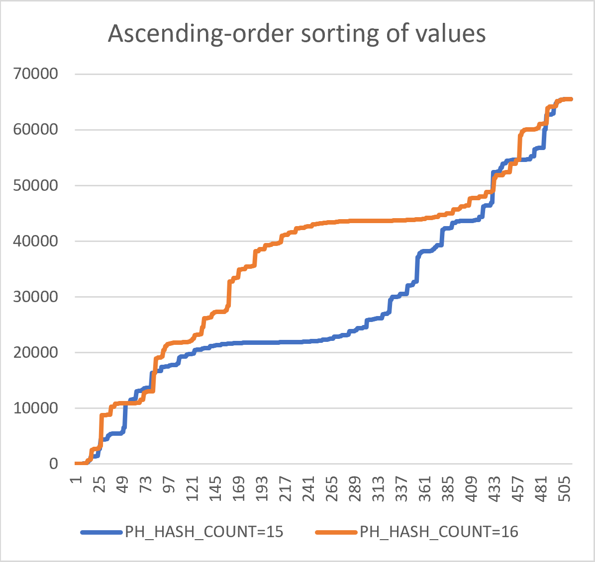

Moreover (but this is a **questionable** observation), here, if the blue line
is subtracted from the orange line, one gets an outline of human's head: with
top (21000), forehead (18000), eye (13000), cheek (6000), and neck (2700)
levels highlighted, roughly corresponding to real symmetry; with a slight
shoulders outline (4100-2700), and two hand palms risen up (5400-4300).


### Fourier Analysis ###

Discrete Fourier (FFT-512) analysis of obtained signals produces the following
power spectrums (with DC component removed). The analysis strengthens the
notion the signal is non-chaotic and is "intelligent" (two strong peaks above
average, in each signal, with both signals producing similar structures, but
with shifted resonant frequencies). Note that resonances in the middle of the
spectrum are similar to resonances one gets when recording an acoustical snare
drum.


### PRNG (Chaotic) Mode ###

Just by changing the PH_HASH_COUNT to 9 (up to 13, inclusive) the same
`proof_math_is_engineered.c` program produces a pseudo-random number sequence,
confirmed with `PractRand` 1KB to 4KB block, 8-bit folding. Note that the same
code producing both chaotic and non-chaotic number sequences is "highly
unlikely" to exist in practical PRNGs. It is important to note that
`PH_HASH_COUNT=14` and `PH_HASH_COUNT=17` (which is beyond 15 and 16 signals
mentioned originally) also pass as random, with 16-bit folding in `PractRand`.
`18` also passes as random, but with a "suspicion". `15` and `16`, of course,
do not pass as random, with many "fails".

It has been observed that in `READ_MODE=0`, but not in `READ_MODE=1`, the
obtained values gradually become noisy, especially at higher `PH_HASH_COUNT`
values.


### Repeating Ornament and Chess-Board (Pixel Art) ###

The 1-bit output with PH_HASH_COUNT= `15` and `16` (`READ_MODE=0`) can be
easily transformed into 256x256 1-bit "pixel art" images, and, quite
unexpectedly, they reproduce a repeating diagonal ornament and a chess-board.

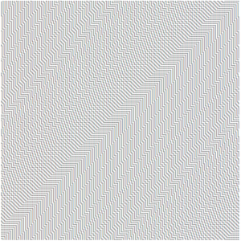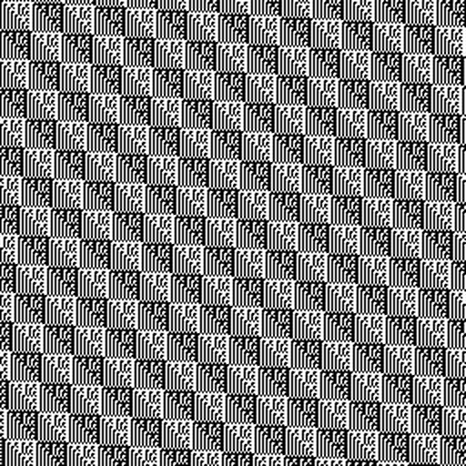

Admittedly, 256x256 size can be considered arbitrarily-chosen (it is a square
of 16, with 16 being the bit-size of values on the graphs above), but it is
the only small size that presents an "intelligible" look. For example, if
`PH_HASH_COUNT=15` is transformed to 240x240 (256-16) "pixel art" image, an
image of "zebra" lines is produced, with bit-reversed variant of the inner
element present in `PH_HASH_COUNT=16`.

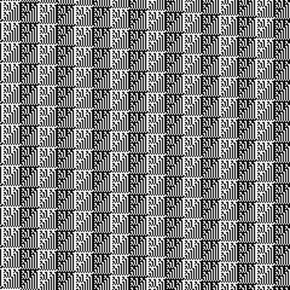

### Christmas Trees (Pixel Art) ###

Much larger `PH_HASH_COUNT` values (with `READ_MODE=1`) produce triangular
structures which are non-repeating, but all have a similar build-up consisting
of rhombic patterns within tree-like structures. The `proof_christmas_tree.c`
program extracts such images into a vertical ASCII-art HTML. It uses the same
underlying 1-bit PRVHASH code, but with "pixel art" decoding method.

One may notice a similarity of the beginning pattern with the [Sierpinski
triangle](https://en.wikipedia.org/wiki/Sierpi%C5%84ski_triangle) (ST).
However, one should consider that ST is a symmetrical triangle fractal that
is constructed from the top-most to bottom levels. PRVHASH-1 produces an
asymmetric (right-handed) triangle in a serie of scanline passes, and it
scales to any `PH_HASH_COUNT` value. The initial part of the image looks like
[Wolfram Rule 102/153](https://plato.stanford.edu/entries/cellular-automata/supplement.html)
"cellular automata" image (ST as well). However, if one considers the whole of
presented details, including previously presented images and graphs, this
leads to conclusion that some very complex "cellular automata" is working
behind the scenes, further strengthening a "presence of intelligence" notion.
Note that Wolfram rules represent sets of "freely-defined fixed information"
which dictates the logical behavior of the cellular automata.

It is also worth noting that PRVHASH-1 initially produces Rule 102/153 image
with a "boundary condition" applied (this can be checked by assigning any
item somewhere in the middle of the hash-array to 1). At the same time, the
function has no such additional logic since the visible scanline is 1 pixel
longer than the `PH_HASH_COUNT` value, meaning this implicit "boundary
condition" is not synchronized with the moment the `HashPos` resets to 0. This
fact tells that the "boundary condition" logic "happens" beyond the common
math, in some way, implicitly. One has to ask themselves - how it is possible
to "embed" at least Rule 102/153 with boundary handling (but much more than
that) into a function as simple (and linear in
[F_2](https://en.wikipedia.org/wiki/GF(2))) as PRVHASH-1? Beside that,
as with the graphs above, presence of exact Rule 102/153 imagery implies
presence of "logic understandable to a human mind", and from computer
programming point of view, the Wolfram rules are an art of "engineering".

Here is an example image with `PH_HASH_COUNT=342`, converted to PNG:


[Here is a link to a larger-sized extract (3.4MB PNG)](https://github.com/avaneev/prvhash/raw/master/img/prvhash1-342-2x64.png)

It is possible to define initial "automata" conditions by filling the
hash-array with alternating bit-values like `10101010...`, or
`100100100100...`, or `1000100010001000...` thus invoking even more complex
"automata" (note that this is done in the same `prvhash` state-space). The
results can be combined into a colored image by assigning the black-and-white
images to different RGB color channels. Considering the `prvhash-1` function
operates with only 3 values at the same time, building a similar "cellular
automata" by using only 3 neighboring pixels seems impossible for human logic.

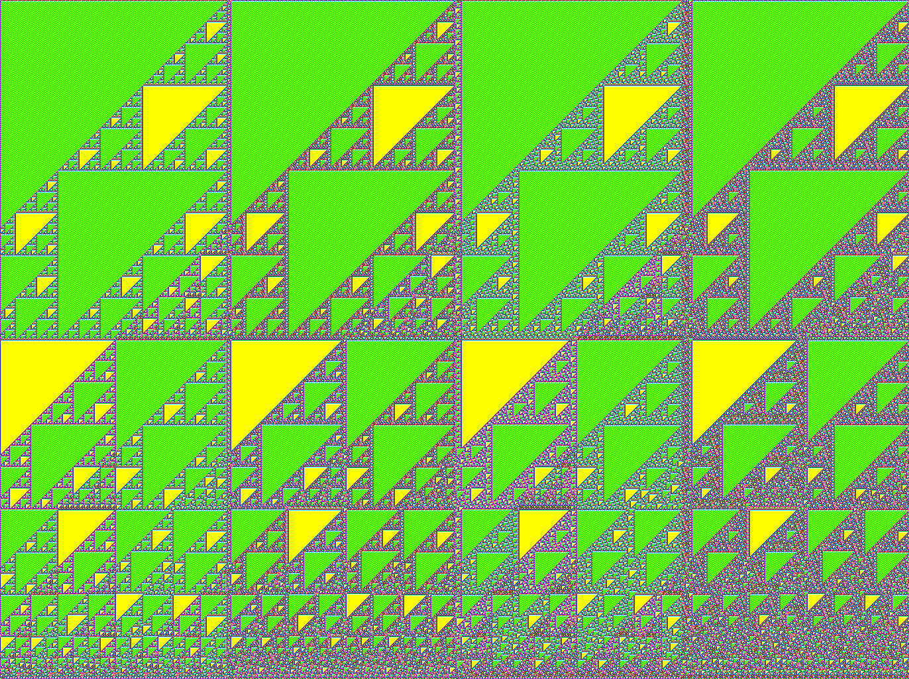

### Fine Art ###

`prvhash-1` can also produce a full-colored "fine art"-like imagery by using a
simple multi-pass buffer accumulation approach. As it turns out, the images of
"cellular automata" shown previously perfectly align on top of each other at
some specific `PH_HASH_COUNT` values (2/3, 4/5 of height, and height-2).
Note that the height of images is usually a "power of 2" value. The
`proof_fine_art.c` program can be used to produce such imagery (requires the
`stb_image_write.h` library).

You may also take a look at an
[animation](https://www.youtube.com/watch?v=qYfGjD19VWo)
which represents a continuous generation while displaying a sum of the recent
255 passes, at every moment.

If this imagery looks intelligent, in some way formulated, where's the
formula? An inception of these results can be understood from this short essay:
[The Informational Deficiency of the "Big Bang"](https://vixra.org/abs/1506.0083)

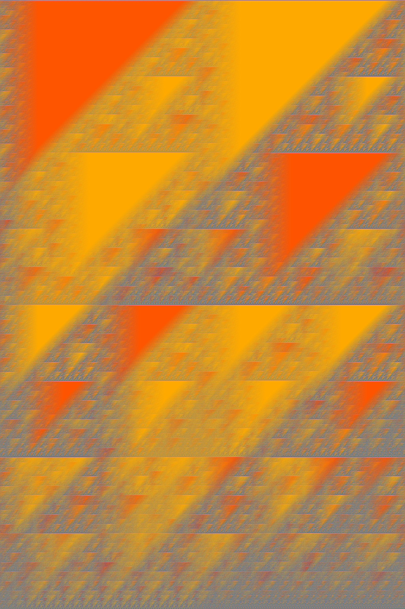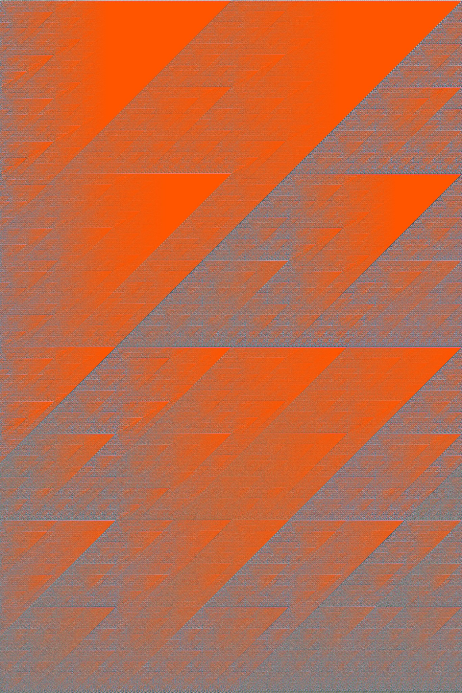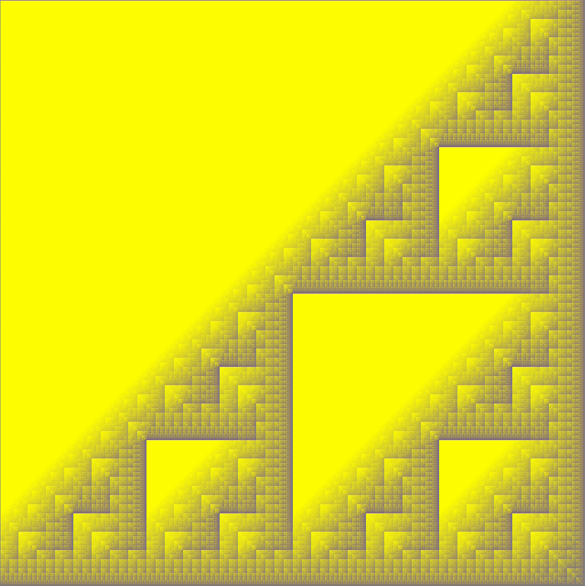

### Reptile Skin ###

The original `prvhash-1` function can be simplified to examine the discovered
"entropy pool" further. The function variant present in the `proof_reptile.c`
file includes the simplified function, but also extends the delay parameter
of the `Seed` delay line from 1 to 32. The resulting image closely resembles
a skin of some reptiles and other organisms. In author's opinion, since the
function works in linear F_2 domain, the same construct can be recreated
physically thus offering an idea that the evolution of intelligence in
organisms may have its roots in mathematics. Image in the middle depicts
result after the first pass over frame; you may note "snake" elements and
computer font-alike outlines there. Image on the right was obtained using
PH_SEED_COUNT=64, note the appearance of a lot of glyph-like elements.

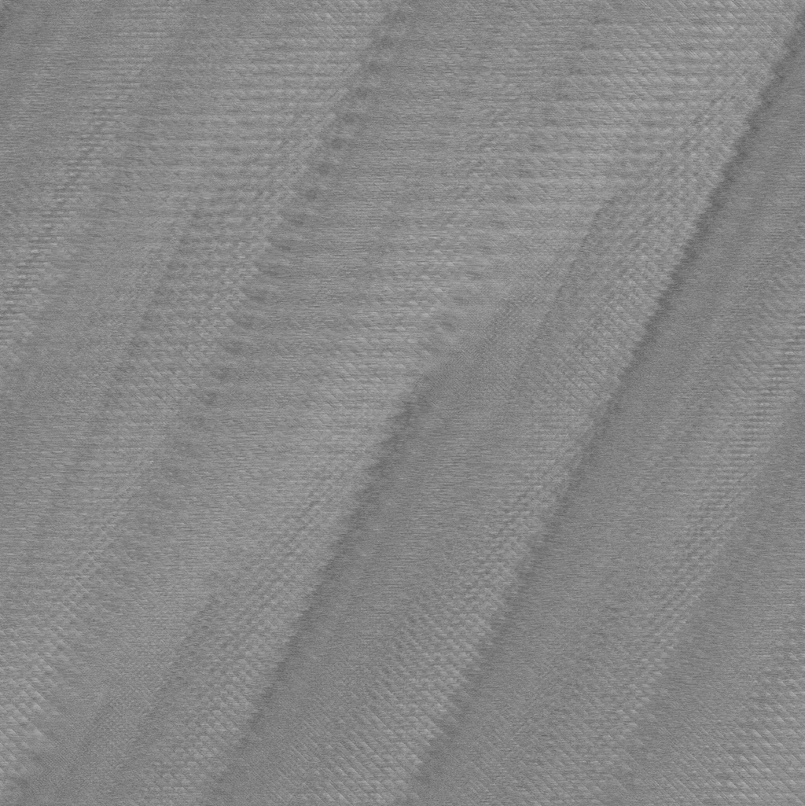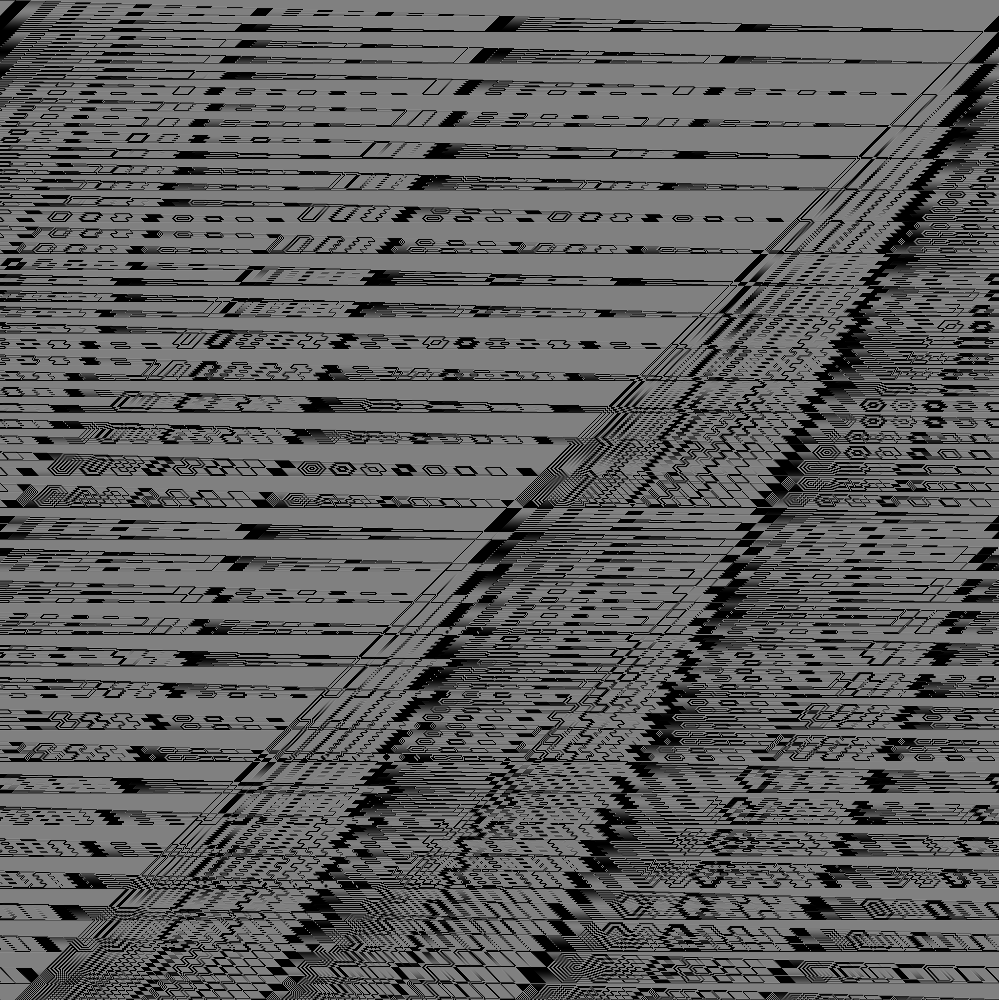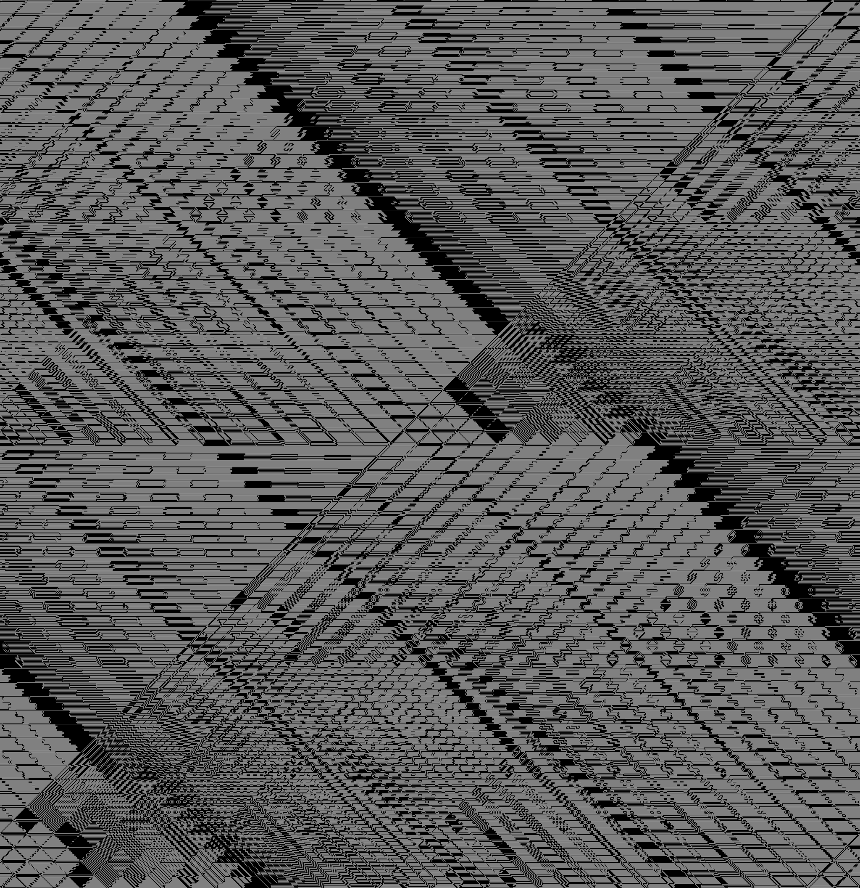

### Architectural Ruler (Gradilac Ruler) ###

Whatever the true source of imagery is, the produced imagery seems to be
useful if applied as some architectural measurement ruler/tool since it can be
used to quickly measure architectural features as whole-number ratios:


## Thanks ##

The author would like to thank Reini Urban for [his SMHasher
fork](https://github.com/rurban/smhasher), Austin Appleby for
[the original SMHasher](https://github.com/aappleby/smhasher),
Chris Doty-Humphrey for [PractRand](http://pracrand.sourceforge.net/), and 
Peter Schmidt-Nielsen for [AutoSat](https://github.com/petersn/autosat).
Without these tools it would not be possible to create PRVHASH which stands
state-of-the-art statistical tests.

## Other ##

PRVHASH "computer program" authorship and copyright were registered at the
[Russian Patent Office](https://rospatent.gov.ru/en), under reg.numbers
2020661136, 2020666287, 2021615385, 2021668070, 2022612987 (searchable via
[fips.ru](https://new.fips.ru/en/)). Please note that these are not "invention
patents"; the registrations assure you that the author has the required rights
to grant the software license to you.

The project is 100% self-funded from legal software sales income, without any
third-party nor state affiliation nor sponsorship.
